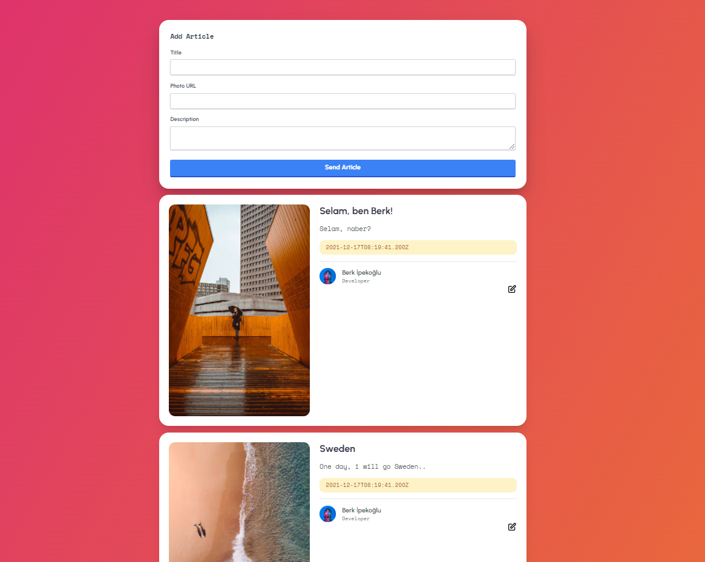

# ui
The UI side of the project is located under this folder. UI made with <b>Vue.js & TailwindCSS</b>.

# backend
The backend part of the project is located under this folder. Made with <b>Node.js</b> and <b>Express.js</b>. <b>MongoDB</b> database is used.

# How can i start it?
Before running the project, don't forget to open the 'server.js' file in the 'backend' folder and make your settings.

<ul>
  <li>First step: backend -> npm install -> node server.js</li>
  <li>Second step: ui -> npm install -> npm run serve</li>
</ul>

# Docker
There are docker files in the backend folder. Just run '<i>docker-compose up</i>' on your cmd.

# Demo

